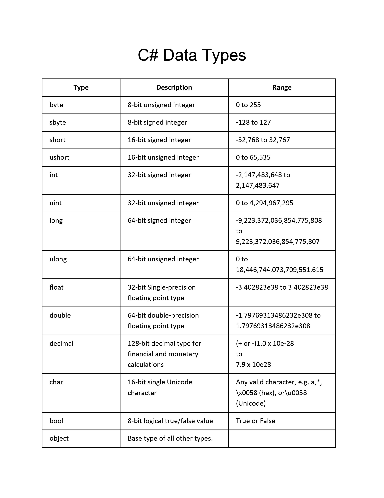
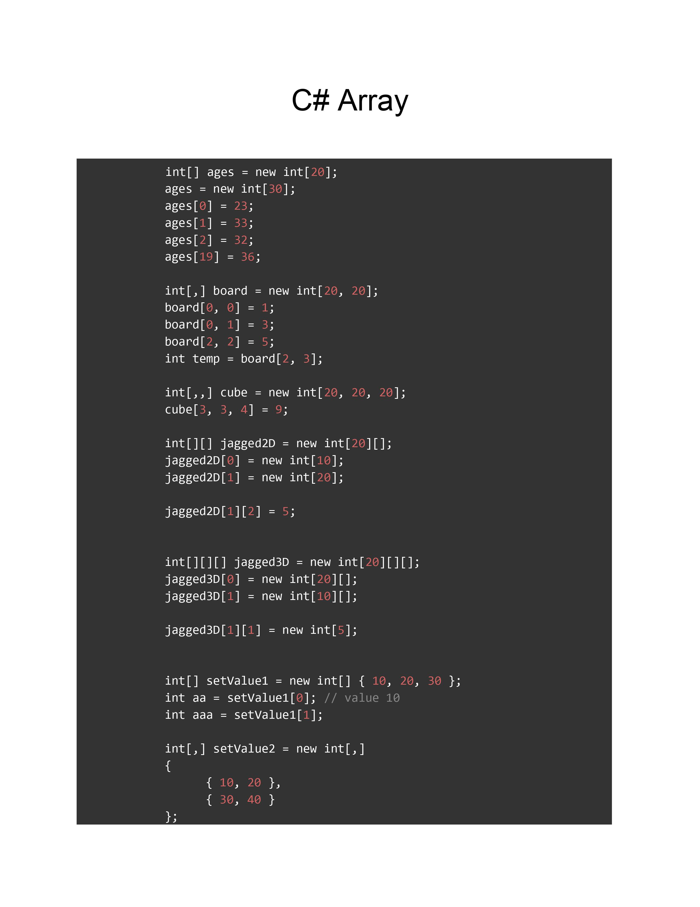
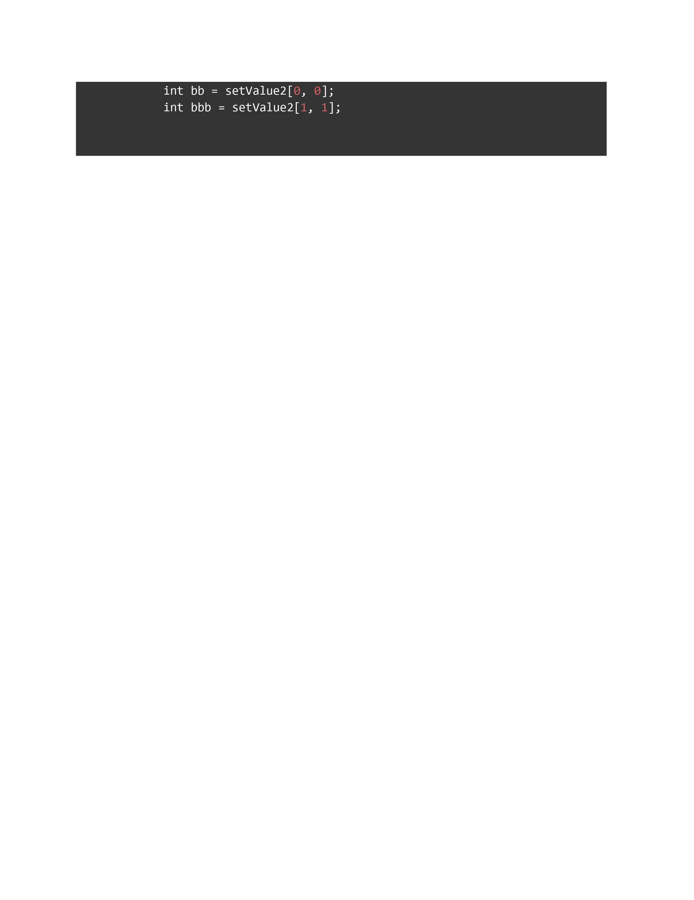
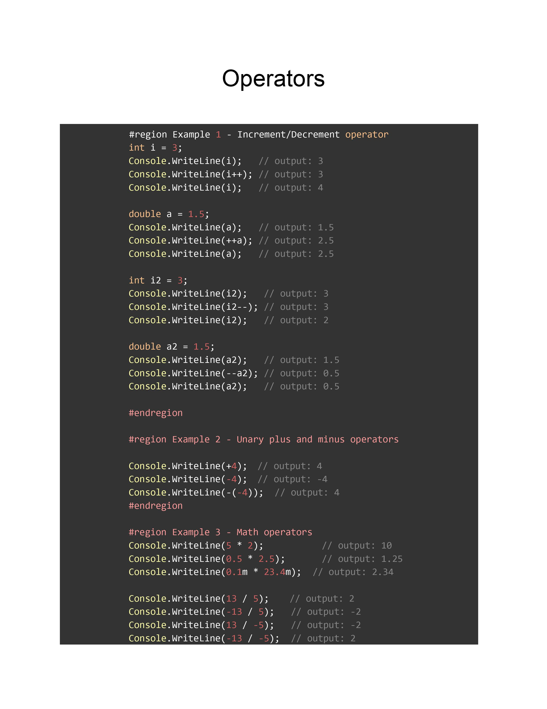
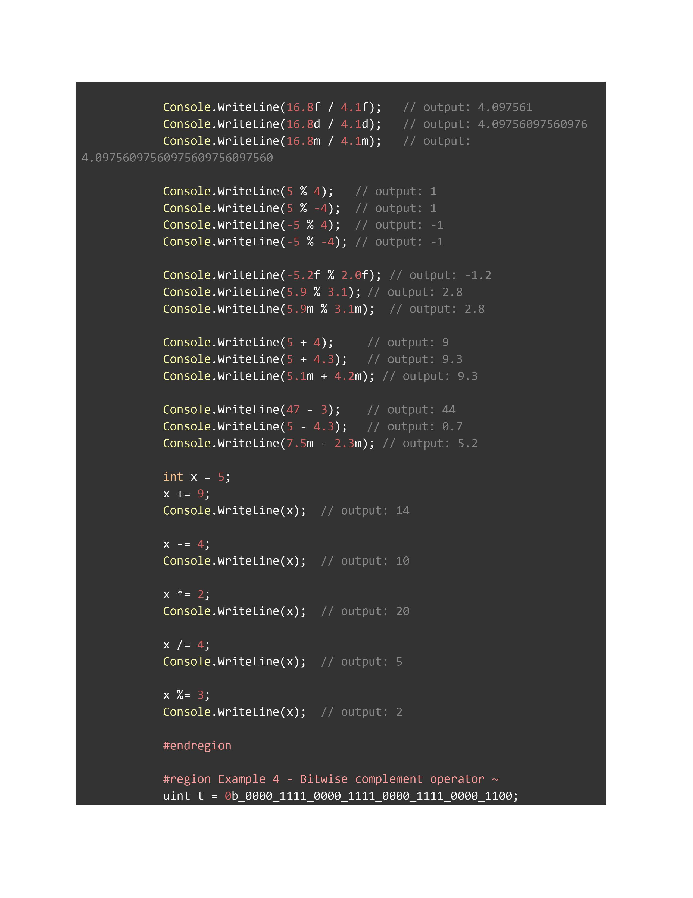
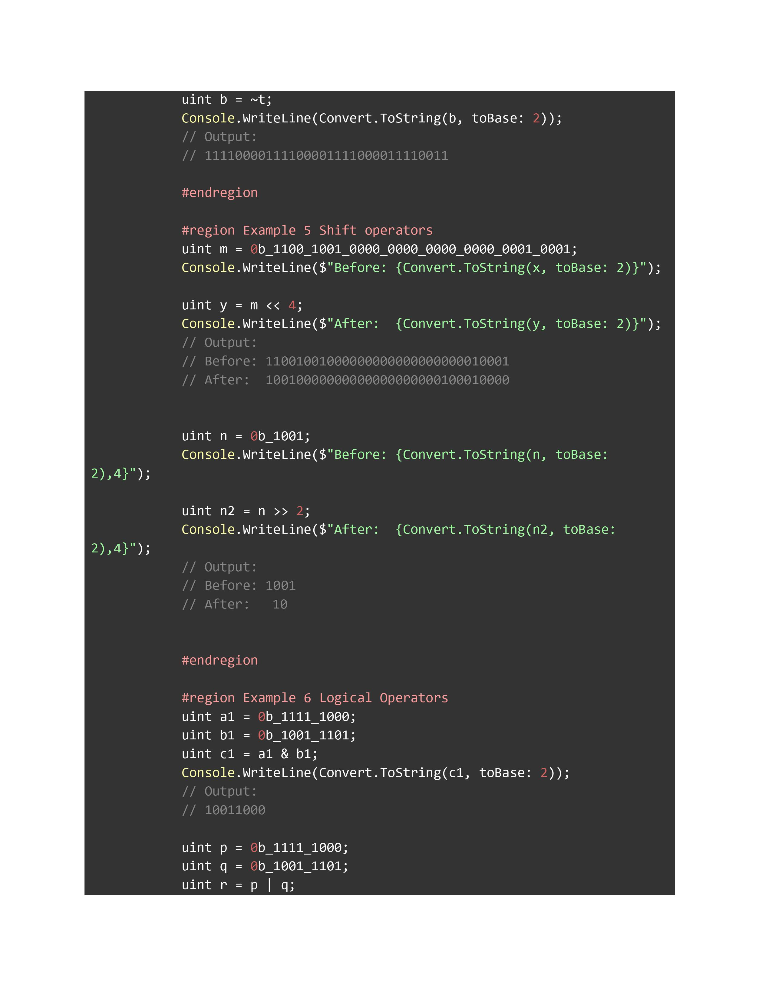
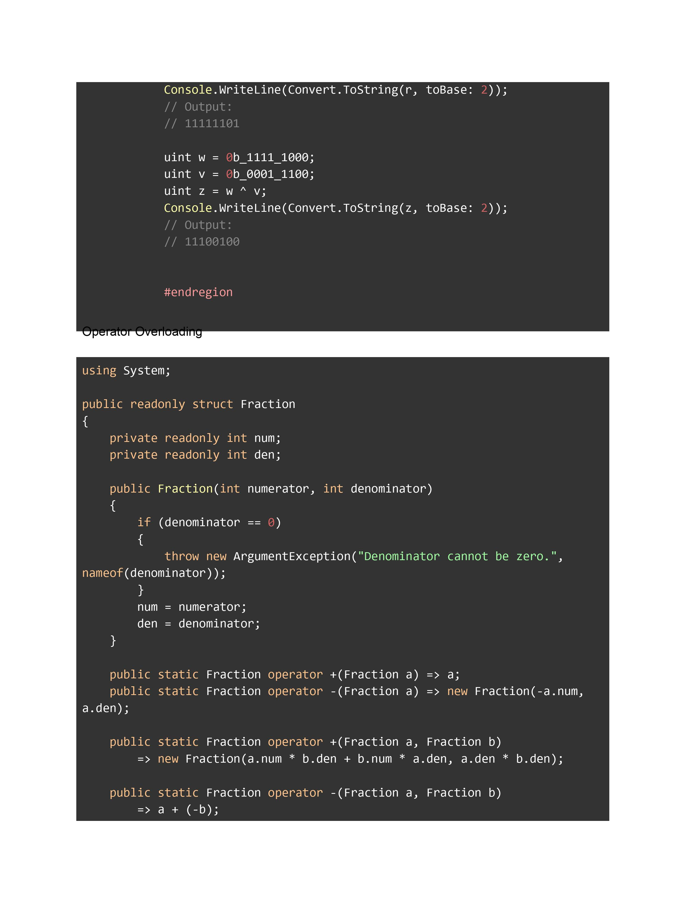
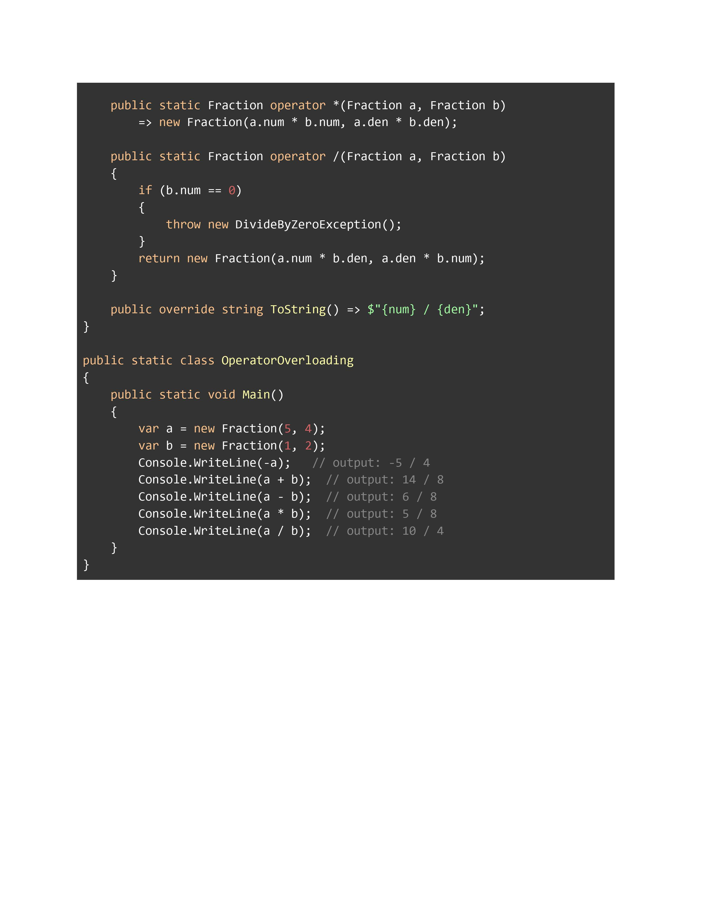

# Welcome To My Notes
### I'm Anisur rahman Faysal.

<br>

<hr>


## Topics <a name="topics"></a>

- Operating Systems And Command Line <a name="os"></a>
  - [Linux Mint](#linuxmint)
  - [Github](#github) <a name="githubback"></a>

<br>
<hr>

- Programming Languages <a name="pl"></a>
  - [C#](#c#)
  <br>
<hr>

- Framework <a name="fw.asp"></a>
  - [ASP.NetWebApi](#asp.netwebapi)

<br>
<hr>

<br>
<hr>

- Framework <a name="fw.laravel"></a>
  - [Laravel](#laravel)

<br>
<br>
<br>

<br>
<br>
<hr>

# [Operating Systems](#os)
 
## Linux Mint <a name="linuxmint"></a> 

### Basic Linux

  
 - [Add Banner In Terminal](#addbannerterminal) <a name="addbannerterminalback"></a>
 - [Show Apps](#showapps)
 - [C# Project Create using VS Code](#c#create)
 - [C# Code Run using VS Code](#c#run)
   
### Installition
 - [XAMPP Install & Uninstall](#xampp)
     - [When Apache Don't Run XAMPP](#apache)
   
 - [PHP Install & Uninstall](#php) <a name="phpback"></a>


<br>
<hr>

### [Add Banner In Terminal](#addbannerterminalback) <a name="addbannerterminal"></a>

  #### Required App (figlet, lolcat)
  ```
  sudo apt install figlet lolcat
  ```

  #### To Know more about figlet
  ```
  man figlet
  ```
  #### Print Banner
  ```
  figlet "faySal"              recommented
  figlet faySal
  ```

  #### Print Banner in center using '-c'
  ```
  figlet "faySal" -c
  ```

  #### Print Banner colourfull using 'lolcat'
  ```
  figlet "faySal" -c | lolcat
  ```  

  #### Add font style using '-f <fontname>'
  ```
  figlet -f slant -c "faySal" | lolcat
  figlet -f digital -c "C# LARAVEL SWE" | lolcat
  ```

  #### To Print banner When Terminal start go to 'bashrc' file using nano
  ```
  nano ~/.bashrc
  ``` 

  #### Past 2 command botton in this bashrc file.
  Save : Ctrl + o Then Enter <br>
  Exit :Ctrl + x

### Show Apps <a name="showapps"></a>
  ```
  dpkg --list
  ```
  Or
  ```
  apt list --installed
  ```

### Prerequisites for C# Code in VS Code <a name="c#prerequisites"></a>
- Visual Studio Code with the C# extension installed. For information about how to install extensions on Visual Studio Code, see VS Code Extension Marketplace.
- The .NET 7 SDK.

- #### Install
```
sudo apt install dotnet-sdk-7.0
```
- #### Remove
```
sudo apt-get remove dotnet-sdk-7.0
```
### C# Project Create using VS Code <a name="c#create"></a>
```
dotnet new console --framework net7.0
```
### C# Code Run using VS Code <a name="c#run"></a>
```
dotnet run
```
- [Prerequisites for coding C# in VS Code](#c#prerequisites)

<br>
<hr>

### Install XAMPP <a name="xampp"></a>

  - #### Step-1(Prerequisites): XAMPP requires the “net-tools” package to be installed on your system. This package can be installed by running the following command in the terminal:
  ```
  sudo apt install net-tools
  ```

  - #### Step-2: Downloading XAMPP via the Internet:

    https://www.apachefriends.org/download.html

  - #### Step-3: Making the Downloaded File Executable:
  ```
  sudo chmod 755 xampp-linux-x64-7.2.34-0-installer.run      
  ```

  - #### Step-4: Installing XAMPP on Linux:
  ```
  sudo ./xampp-linux-x64-7.2.34-0-installer.run
  ```
<br>
<br>

  ### Uninstall XAMPP <a name="uninstall"></a>

  - #### Step-1: Go to directory.
  ```
  cd /opt/lampp
  ```
  - #### Step-2: Uninstall.
  ```
  sudo ./uninstall
  ```
  - #### Step-2: Remove directory.
  ```
  sudo rm –r /opt/lampp
  ```

<br>
<hr>

### Apache Force Run<a name="apache"></a>

- #### Step-1
```
sudo apachectl stop
```
- #### Step-2
```
sudo /opt/lampp/lampp start
```

<br>
<hr>

### [PHP Install & Uninstall](#phpback) <a name="php"></a>

#### Install PHP
```
sudo apt install php
```
#### Install Composer
```
sudo apt install composer
```
#### Dependency
```
sudo apt install php-common php-curl php-json php-readline php-fpm php-cli php-xml php-mcrypt php-zip php-mbstring php-gd
```

<br>
<hr>

## [Github](#githubback) <a name="github"></a> 


<br>
<hr>

# [Programming Languages](#pl)
## C <a name="c"></a> 
## C# <a name="c#"></a>
 - [C# Development Environment Setup](#des) <a name="desback"></a>
 - [C# Output](#output) <a name="outputback"></a>
 - [C# DataType](#datatype) <a name="datatypeback"></a>
 - [C# Variables](#variables) <a name="variablesback"></a>
 - [C# Method of string and char](#method) <a name="methodback"></a>
 - [C# Arrays](#array) <a name="arrayback"></a>
 - [C# Operators](#operators) <a name="operatorsback"></a>
 - [C# Operators](#methods) <a name="methodsback"></a>

<br>
<hr>

### [C# Development Environment Setup](#desback) <a name="des"></a>

<p>C# is pronounced "C-Sharp".

It is an object-oriented programming language created by Microsoft that runs on the .NET Framework.

C# has roots from the C family, and the language is close to other popular languages like C++ and Java.

The first version was released in year 2002. The latest version, C# 11, was released in November 2022.

C# is used for:</p>

    - Mobile applications
    - Desktop applications
    - Web applications
    - Web services
    - Web sites
    - Games
    - VR
    - Database applications
    - And much, much more!

<br>
<hr>
  
### [C# Output](#outputback) <a name="output"></a>

<p>To output values or print text in C#, you can use the WriteLine() method:</p>
   
```
   Console.WriteLine("Hello World!");
```
```
Console.WriteLine(3 + 3);
```
```
Console.Write("Hello World! ");
```     
   
<br>
<hr>


### [C# DataType](#datatypeback) <a name="datatype"></a>


<p> A data type specifies the size and type of variable values. It is important to use the correct data type for the corresponding variable </p>





<br>
<hr>


### [C# Variables](#variablesback) <a name="variables"></a>


<p>Variables are containers for storing data values.

In C#, there are different types of variables (defined with different keywords), for example:</p>

- int - stores integers (whole numbers), without decimals, such as 123 or -123
- double - stores floating point numbers, with decimals, such as 19.99 or -19.99
- char - stores single characters, such as 'a' or 'B'. Char values are surrounded by single quotes
- string - stores text, such as "Hello World". String values are surrounded by double quotes
- bool - stores values with two states: true or false

<b><p>type variableName = value;</p></b>


```C#
  int myNum = 5;
  double myDoubleNum = 5.99D;
  char myLetter = 'D';
  bool myBool = true;
  string myText = "Hello";
```

<p>This will declare the variable as "constant", which means unchangeable and read-only:</p>

```C#
  const int myNum = 15;
  myNum = 20; // error
```

<p>Note: You cannot declare a constant variable without assigning the value. If you do, an error will occur: A const field requires a value to be provided.</p>

<br>
<hr>


### [C# Method of string and char](#methodback) <a name="method"></a>


<p>A method is a code block that contains a series of statements</p>


#### Write()
<p>Console.Write is used to print data without printing the new line</p>

```
Console.Write();
```

#### WriteLine()
<p>Console.WriteLine  is used to print data along with printing the new line.</p>

```
Console.WriteLine();
```

#### Split()
<p>In C#, Split() is a string class method. The Split() method returns an array of strings generated by splitting of original string separated by the delimiters passed as a parameter in Split() method.</p>

NB: Split store in string array veriable.

```
  String input = Console.ReadLine();
  String[] partsOfLine = input.Split(' ', ',');
```

#### Parse()
<p>Parse() converts the string data type to another data type.</p>

```
  int[] number = new int[3];

  String input = Console.ReadLine();
  String[] partsOfLine = input.Split(' ', ',');

  number[0] = int.Parse(partsOfLine[0]);
  number[1] = int.Parse(partsOfLine[1]);
  number[2] = int.Parse(partsOfLine[2]);
```


#### Important C# String and Char Methods


<br>
<hr>


### [C# Arrays](#arrayback) <a name="array"></a>

 - [C# Array Declaration and Initialization](#dsi) <a name="desback"></a>
 - [C# Array Manipulation](#output) <a name="outputback"></a>
 - [C# Examples](#method) <a name="methodback"></a>
 - [C# Parameter Arrays](#datatype) <a name="datatypeback"></a>
 - [C# Multi-Dimensional Array](#variables) <a name="variablesback"></a>
 - [C# Array Images](#arrayimages) <a name="arrayimagesback"></a>

 ### [Declaration](#dsi)

<p>Arrays are used to store multiple values in a single variable, instead of declaring separate variables for each value.</p>






<br>
<hr>

### [C# Operators](#operatorsback) <a name="operators"></a>


<p>Operators, in C#, are symbols used within an expression or statement to specify the operations to be performed during evaluation of the expression.</p>









<br>
<hr>


    

## JavaScript <a name="javascript"></a> 
## PHP <a name="php"></a> 

# [Framework](#fw.laravel)

## Laravel <a name="laravel"></a>
  - [Mastering](#mastering)
  - [CRUD](#crud)<a name="crudback"></a>
  - [Auth](#auth)
  - [Multi User Dashboard](#validation)
  - [Middleware](#validation)
  - [Eloquent ORM](#validation)
  - [Query Builden](#validation)
  - [API](#validation)
  - [Mailing](#validation)
  - [October CRM](#validation)


<br>
<hr>

## Mastering <a name="mastering"></a> 
## [CRUD](#crudback) <a name="crud"></a>
 - [Create](#create) <a name="createback"></a>
 - [Read](#read) <a name="readback"></a>
 - [Update](#update) <a name="updateback"></a>
 - [Delete](#delete) <a name="deleteback"></a>


<hr>
<br>

### [Create](#createback) <a name="create"></a>
  - Create
      - Resource Controller:
    ```
    php artisan make:controller Frontend/ContactController -r
    ```
    Then go: App\Http\Controllers\Frontend\Controller\ContractController
    ```php
      class ContactController extends Controller
    {
      /**
       * Display a listing of the resource.
       */
      public function index()
      {
          //
      }

      /**
       * Show the form for creating a new resource.
       */
      public function create()
      {
          //
      }

      /**
       * Store a newly created resource in storage.
       */
      public function store(Request $request)
      {
          dd($request->all());
      }

      /**
       * Display the specified resource.
       */
      public function show(string $id)
      {
          //
      }

      /**
       * Show the form for editing the specified resource.
       */
      public function edit(string $id)
      {
          //
      }

      /**
       * Update the specified resource in storage.
       */
      public function update(Request $request, string $id)
      {
          //
      }

      /**
       * Remove the specified resource from storage.
       */
      public function destroy(string $id)
      {
          //
      }
    }
    ```
      - Resource Route:
   ```
    Route::resource('/contact', ContactController::class);
   ```
      - Index to Route
    

    
  - Validation
  - Store
### [Read](#readback) <a name="read"></a>
### [Update](#updateback) <a name="update"></a>
### [Delete](#deleteback) <a name="delete"></a>


```bash
php artisan make:request StoreRequest
```
